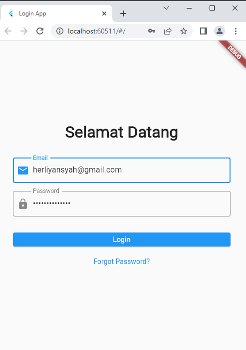
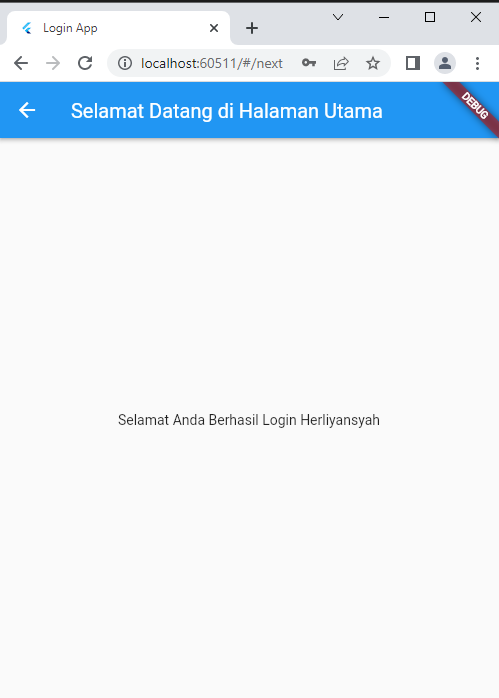

| Herliyansyah          | 312010387             |
|-----------------------|-----------------------|
|  TI.20.A.2            | PEMROGRAMAN MOBILE    |
| UJIAN TENGAH SEMESTER | LOGIN FLUTTER         |

## UJIAN TENGAH SEMESTER

## SEMESTER 6

### Membuat Login Dengan Flutter

### 1. Tampilan Halaman Login 

**Diatas adalah contoh Halaman login atau Tampilan Login dengan menggunakan Flutter dalam bahasa Dart**

**Jika ingin Masuk pastikan sudah mengisi ***Email*** dan ***Password*** pada halaman login tersebut jika berhasil maka ada halaman berikutnya**

### 2. Tampilan Halaman Utama Setelah Login

**Diatas adalah Contoh Halaman Utama setelah berhasil ***Login*** hanya memunculkan halaman utama yg belum diisi apapun**

### Selesai

### Terima Kasih

